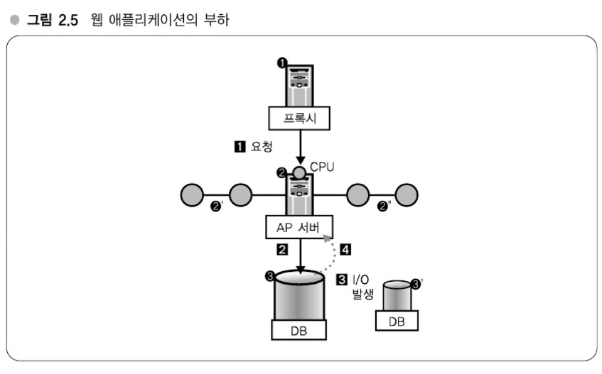

# 2장: 대규모 데이터 처리 입문(메모리와 디스크, 웹 애플리케이션과 부하)
## 대규모 데이터 특유의 환경 알기
### 2 ~ 5장에 대해
- 하테나 서비스 설계를 통해 대규모 데이터 처리방법에 대해 다룸
- 2창 : 대규모 데이터 처리와 관련한 개요 (대규모 데이터란 무엇인가)
- 3장 : OS와 캐시
- 4장 : 대규모 운영을 전제로 한 DB, OS, 미들뒈어와 발전
- 5장 : 대규모 데이터를 이용하는 애플리케이션 개발의 급소에 대해
- 6 ~ 10장 : 애플리케이션 개발자를 대상으로 대규모 데이터를 처리하는 방법을 실제 사례와 함께

- - -
## 강의4 - 하테나 북마크의 데이터 규모
### 하테나 북마크를 예로 본 대규모 데이터
- 하테나 북마크의 데이터 양
  ```sql 
  mysql> select count(*) from relword; -- 351277311 (3억 5천만 로우, 약 10GB)
  ```
    - 이정도 규모에서 `select * from relword;` 이런식으로 쿼리를 날리면 엄청 오래 걸림 (구글은 테라, 페타 바이트 규모)
    - 또한 `entry 테이블 : 1520만 row, 3GB`, `bookmar 테이블 : 4500만 row, 5.5GB`, `tag 테이블 : 5000만 row, 200GB`

### 대규모 데이터로의 쿼리 (대규모 데이터를 다루는 감각)
- 인덱스를 태우지 않았을 때 1건을 검색하는데 200초 이상 걸림 (~~이때 당시 하드웨어 성능도 좋지 않아 더욱 심했을 듯~~)

- 시행 착오를 겪으며 노하우를 축적하자는 컬럼이 나옴 (공감)
    - 문제가 발생하면 생각하자. (`앞서 걱정하지 말자` 라는 느낌, `어느 정도`만 걱정하자, 어느 정도가 어디까지?)

- - -
## 강의5 - 대규모 데이터 처리의 어려운 점 (메모리와 디스크)
### 대규모 데이터는 어떤 점이 어려운가? (메모리 내에서 계산할 수 없다)
- 대규모 데이터를 다룰 때 까다로운 점은 `메모리 내에서 계산할 수 없다`는 포인트가 있음
    - 메모리에 올리지 않으면 디스크를 읽어가며 검색해야 됨. -> 디스크는 성능이 느림 -> 서비스가 느려짐

### 메모리와 디스크의 속도차 (메모리가 10^5 ~ 10^6배 이상 빠름)
- 10만 ~ 100만 배 차이

    - jeff dean의 하드웨어 성능 비교 \


### 디스크는 왜 늦을까?
- 컴퓨터 구조에 관해 설명함 (메모리와 HDD의 관해)
- HDD라 물리적인 원판을 이동하는데 시간도 발생 등

### OS 레벨에서의 연구
- 디스크가 느림을 커버하기 위해 연속된 데이터를 같은 위치에 쌓고, 데이터를 읽을 때 4KB 정도를 한 번에 읽음 (~~페이지?~~)
    - 비슷한 곳에 두어 1번의 디스크 회전으로 데이터를 많이 읽을 수 있게

### 전송 속도, 버스의 속도차
- 지금까지의 속도는 데이터를 탐색할 때의 속도, 이번에 얘기할 속도는 `데이터의 전송 속도`에 대해 다룸 (ex. Memory -> CPU)
    - `hdparm`이라는 Linux 툴을 사용해 전송 속도 확인 (책 기준으로 메모리가 디스크(HDD)보다 100배정도 빠름)
    - SSD 또한 원판을 돌리는 회전이 없어 Seek(탐색)은 빠르지만 메모리보단 느림

### Column (OS 레벨의 기초지식 1)
- **추측하지 말라, 계측하라**
    - 부하가 어느 정도 걸리고 있는지 조사하고, 이런 계측 작업이야 말로 단일 호스트의 부하를 줄이는 데 가장 중요한 작업
- **CPU 부하가 높을 경우**
    - `사용자 프로그램 처리`를 위한 병목인지, `시스템 프로그램이 원인`인지 확인 필요 (linux `top` 또는 `sar`로 확인 가능)
    - `ps`로 볼 수 있는 프로세스의 상태나 CPU 사용 시간 등을 보면서 원인이 되는 프로세스 파악
    - 프로세스 파악 후 더 상세하게 조사할 경우 `strace`로 추적하거나 `oprofile`로 프로파일링해 병목 지점을 찾을 수 있음
- **CPU 부하가 걸리고 있다는 상황일 때 조사 방식**
    1. 디스크나 메모리 용량 등 그 밖의 부분에서는 병목이 되지 않는, 이상적인 상태
    2. 프로그램이 폭주해서 CPU에 필요 이상의 부하가 걸리는 경우
    - (1)의 상태에다 시스템 전송량에 문제가 있다면 `서버 증설` 또는 `프로그램의 로직` 또는 `알고리즘 개선`해서 대응
    - (2)의 경우는 오류를 제거해 프로그램이 폭주하지 않도록 대응
- **I/O 부하가 높은 경우**
    - `프로그램으로부터 입출력이 많아`서 부하가 높거나 `스왑이 발행해서 디스크 액세스가 발생`하고 있는 상황 중 하나
    - `sar` 이나 `vmstat` 명령어로 스왑의 발생 상황을 확인해 문제를 찾을 수 있음
- **I/O 부하가 걸리고 있다는 상황일 때 조사 방식**
    - 특정 프로세스가 극단적으로 메모리를 소비하고 있는지 `ps`로 확인
    - 프로그램의 오류로 메모리를 지나치게 사용하고 있는 경우 프로그램 개선
    - 탑재된 메모리가 부족한 경우 메모리 증설 (증설할 수 없으면 분산 고려)
    - 디스크로 입출력이 빈번하다면 캐시에 필요한 메모리가 부족한지 검사
- 튜닝의 본래 의미는 **병목이 발견되면 제거하는** 작업
    - 하드웨어나 소프트웨어가 지니고 있는 성능 이상의 성능을 내지 못 함
    - 고속도로의 차선이 아무리 많아져도, 자동차가 목적지에 걸리는 시간은 달라지지 않음

- - -
## 강의6 - 규모 조정의 요소
### 규모 조정(scaling), 확장성(scalability)
- 웹 서비스에서는 일반적인 성능의 하드웨어를 많이 나열하는 **스케일 아웃** 전략이 주류
    - 스케일 아웃이 주류인 이유는 웹 서비스에 적합한 형태이고, 비용이 저렴하고 시스템 구성에 유연성이 있다는 포인트가 있음

### 규모조정의 요소 - CPU 부하와 I/O 부하
- 횡(스케일 아웃)으로 확장하는 방식은 CPU 부하의 확장성을 확보할 순 없음
    - `HTTP 요청 -> DB 질의 -> DB 응답 가공 -> HTML 반환`의 형태는 **CPU 부하**만 소요
    - 이는 프록시나 AP(Application server)가 담당
    - `DB 서버`는 **I/O 부하**가 걸림

### 웹 애플리케이션과 부하의 관계

- `AP 서버`에서는 `CPU 부하`가 걸리고, `DB 서버`에서는 `I/O 부하`가 걸린다.
- `AP 서버`는 CPU 부하만 걸리므로 **분산 간단**
	- 기본적으로 데이터를 분산해서 갖는 것이 아님, 서버 대수만 늘리면 확장 가능 (`로드 밸런서`로 요청을 균등하게 분산 가능)
- I/O 부하를 담당하는 `DB를 분산`하는 것은 조금 더 복잡
	- 원본 서버와 분산된 서버의 **동기화**가 어려움

### DB 확장성 확보의 어려움
- DB 서버에서는 I/O 작업으로 인해 디스크도 많이 사용하게 된다. (디스크는 느림)
    - 데이터가 커질수록 메모리에서 처리하지 못 하고 디스크에서 처리할 수 밖에 없음
- 서비스 운영시 서버를 늘려서 해결할 수 있다면 간단한 문제. (단순히 늘리기만 하면 되니까..)

> **Memo - 요약**
>
> - `CPU 부하`의 규모 조정은 간단
    > 	- 같은 구성의 서버를 늘리고, 로드밸런서로 분산
           > 	- 웹, AP 서버, 크롤러 등
> - `I/O 부하`의 규모 조정은 어려움
    > 	- DB
           > 	- 대규모 데이터(강의 7)

### Column (OS 레벨의 기초지식 2)
- 일반적으로 AP 서버는 DB로부터 얻은 데이터를 가공해 클라이언트로 전달하는 처리를 수행
    - 이 과정에서 대규모 I/O는 드물다. **즉, 대부분의 `AP 서버`는 CPU 바운드 서버**
- DB 서버는 데이터를 디스크로부터 검색하는 일이 주된 일
    - 데이터가 대규모가 되면 될수록 I/O에 대한 영향이 커진다. **즉, 대부분의 `DB 서버`는 I/O 바운드 서버**
- 최근 OS(Windows, Linux 등)는 동시에 서로 다른 여러 테스크를 처리할 수 있음
    - 완전 동시가 아니라 **매우 짧은 시간 간격으로 여러 테스크를 전환**해가며 처리함 (CPU 코어 수 만큼만 동시 가능)
- Average에 대해 다루면서 CPU 인터럽트에 대해(그 중 `타이머 인터럽트`에 대한) 이야기 함
    - CentOS 5의 타이머 인터럽트는 4ms - 이 인터럽트마다 CPU 시간을 진행시키거나, 실행 중인 프로세스가 CPU를 어마나 사용했는지 계산하는 등 시간에 관련된 처리 수행

- - -
## 강의 7 - 대규모 데이터를 다루기 위한 기초지식
### 대규모 데이터를 다루는 세 가지 급소 - 프로그램을 작성할 때 요령
- `어떻게 하면 메모리에서 처리를 마칠 수 있을까?`를 고민해야 됨
    - 디스크 seek 횟수 최소화
    - 국소성(= 지역성, locality)을 활용한 분산 (3장)
- 데이터 증가에 강한 알고리즘과 데이터 구조 사용
    - ex) 선형검색(`O(n)`) -> 이분검색(`O(log n)`)
- 데이터 압축, 정보검색기술(특정 용도에 특화된 검색 엔진을 만들어 처리)

### 대규모 데이터를 다루기 전 3대 전제지식 - 프로그램 개발의 한층 아래 기초
1. OS 캐시 (3장)
2. 분산을 고려한 RDB를 운영한다는 것 (4장)
3. 대규모 환경에서 알고리즘과 데이터 구조를 사용한다는 것 (5장)
- 하테나 북마의 경우 AP 서버는 10대, DB 서버는 25대로 사용 중

### Column (OS 레벨의 기초지식 3)
- **`sar(System Activiry Reporter)`로 CPU 사용률, I/O 대기율 확인 가능**

