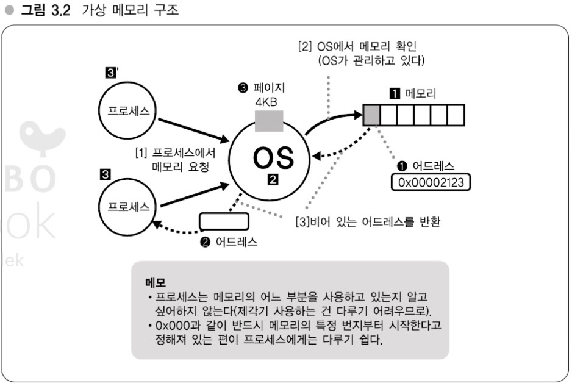
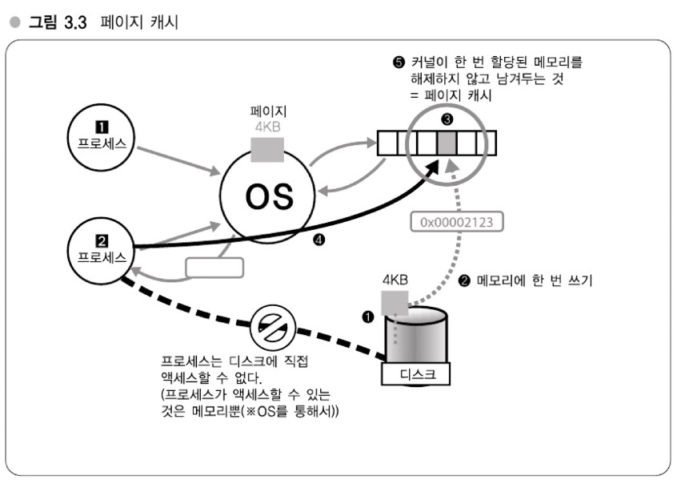

# 03장 - OS 캐시와 분산
## 이번 장에서 다루는 내용
- OS 캐시가 무엇인지 원리 파악 (강의 8)
- 원리를 바탕으로 OS 캐시를 활용해 I/O 부하를 줄이는 법 (강의 9)
- 캐시를 고려한 국소성을 살리는 분산 (강의 10)

- - -
## 강의 8: OS 캐시 구조
### OS의 캐시 구조를 알고 애플리케이션 작성하기 (페이지 캐시)
- OS는 메모리를 이용해 디스크 액세스를 줄임 - 이를 잘 활용하자.
    - 이를 `OS 캐시`라고 부르고, Linux의 경우 `페이지 캐시`, `파일 캐시`, `버퍼 캐시`라는 캐시 구조를 갖고 있음
    - 저자는 파일 캐시는 그다지 적절하지 않다고 함 (이 책에서는 OS 캐시를 `페이지 캐시`라고 함)
       
> 다음의 그림으로 기준으로 메모리에 대해 설명함

### Linux의 페이지 캐시 원리 (60p)
- 프로세스가 디스크로부터 데이터를 읽는 과정
    1. OS는 디스크로부터 4KB 크기의 블록을 읾음
    2. 읽어낸 것을 메모리로 옮김 (프로세스는 디스크에 직접 액세스 할 수 없음) \
       
            Q. 이러한 이유로 인해 1장에서 `I/O 부하가 높을 경우 메모리를 높이는 이유`가 될 수도 있을 것 같다.

#### 페이지 캐시의 친숙한 효과
- 대부분 현대 OS는 디스크에서 데이터를 읽으면 `꼭 한 번은 메모리로 가서 데이터가 캐싱`된다.
    - 즉, 두 번째 이후의 액세스가 빠르다.
    - OS를 계속 가동시켜 두면 메모리가 허락하는 한 디스크상의 데이터를 계속 캐싱하므로 더 빨라진다.

> **Memo**
>
> - 디스크 내용을 메모리로 올림(읽음)
    > 	- 페이지 작성 됨
> - 작성된 페이지는 파기되지 않고 남음
    > 	- 페이지 캐시
> - 예외의 경우를 제외하고 모든 I/O에 투과적으로 작용
    > 	- 디스크 캐시를 담당하는 곳 (VFS)

### VFS(Virtual File System, 가상 파일시스템)
- `디바이스 드라이버` -> `파일 시스템(Linux의 ext4 같은)` -> `vfs` 이런 순서로 계층이 있음
    - 왼쪽부터 하드웨어와 가까운 순서
    - 파일시스템은 다양한 함수를 갖고 있다. 그 인터페이스를 통일 하는 것이 VFS의 역할
    - 또한 VFS가 페이지 캐시의 구조를 지니고 있어 `어떤 파일시스템` 또는 `어떤 디스크`를 읽더라도 **동일한 구조로 캐싱**된다.
- 다시 VFS의 역할은 파일시스템 구현의 추상화와 성능이 관련된 페이지 캐시 부분

### Linux는 페이지 단위로 디스크를 캐싱한다 (파일 캐시 이름이 적절하지 않은 이유)
- 메모리가 2GB 일 때, 파일이 4GB라면 캐싱할 수 없을까?
    - 있음. 파일 캐시로 생각하면 메모리 용량이 부족해 안 될 것 같지만, **OS는 블록(페이지) 단위로 캐싱하기 때문에 가능하다.**
    - 즉, 전체 파일을 캐싱할 순 없지만 일부분의 캐싱은 가능하다.
- Linux는 `i노드 번호`와 파일의 어느 위치부터 시작할지 나타내는 `오프셋` 이 **두 값을 키로 캐싱**함
    - 즉, `어떤 파일(i-node)`의 `어느 위치(오프셋)`라는 쌍으로 캐시의 키로 설정, 이 방식으로 **파일의 일부를 캐싱**할 수 있음
    - 해당 페이지를 찾을 때 데이터 구조는 최적화되어 있음
        - OS(= 커널) 내부에서 사용되고 있는 데이터 구조는 Radix Tree -> 파일이 아무리 커져도 탐색속도가 떨어지지 않음

### 메모리가 비어 있으면 캐싱 (`sar로` 확인 가능)
- Linux는 메모리가 비어 있으면 전부 캐싱 (메모리가 비어 있다면 계속 캐싱)
- 메모리가 가득 찼다면 오래된 캐시를 버리고 메모리 확보 (LRU 알고리즘) (64p)

### 메모리를 늘려서 I/O 부하 줄이기
- 메모리를 늘리면 캐시에 사용할 수 있는 용량이 늘고, 보다 많은 데이터를 캐싱할 수 있다. (디스크 읽는 횟수가 줌)

### 페이지 캐시는 투과적으로 작용한다
- 특정 파일을 read할 때 **메모리 여유 공간이 있다면** 읽은 파일을 쭉 캐싱
    - ex) 처음 메모리 사용량이 `500MB`라고 가정하고, 이후 `1GB` 파일을 읽으면 메모리는 `1.5GB`를 사용하게 됨

### Column (OS 레벨의 기초지식 4)
- OS를 확인할 수 있는 지표를 참조하는 것이 좋음
- 그 중 `sar` 대해 다루고, 두 가지 사용법에 대해 나옴
    1. 과거의 통계 데이터로 거슬러 올라가 접근 (기본값)
    2. 현재의 데이터를 주기적으로 확인

- - -
## 강의9: I/O 부하를 줄이는 방법
### 캐시를 전제로 한 I/O 줄이는 방법
- 다루고자 하는 데이터의 크기가 중요.
    - 물리 메모리가 더 크면 전부 캐싱해버리면 됨
    - 데이터를 압축 해 캐싱하는 방법도 있음
- 경제적인 비용과 밸런스를 고려하자.
    - 이때 당시(책 집필 시기, 2009년 9월)의 8~16GB 정도가 서버 한 대의 메모리 구성
        - AP 서버는 4GB 정도만 있어도 충분, DB 서버는 8~16GB 필요
    - 2007년(2년 전)에 8GB의 메모리의 가격이 3~4만엔 정도 인데,
        - 5명을 반 년 동안 투입해 대단한 압축 알고리즘을 만들어 사용
        - 2009년(2년 후)에 8GB 메모리의 가격이 1만엔 정도로 줄었다.
    - 데이터가 8GB 메모리만 있어도 충분하다면 반 년 동안 만든 대단한 압축을 만들었을 필요가 있을까에 대해 나옴
        - Q. 1년 반 동안 사용했다? 합리적 인 것 같기도..?

> **Memo**
>
> - `데이터 규모 < 물리 메모리` 이면 전부 캐싱 가능
> - 경제적 비용과의 밸런스 고려
    > 	- 2009년 당시 일반적인 서버 메모리 8 ~ 16GB (Q. 현재는 어느 정도지?)

### 복수 서버로 확장시키기 - 캐시로 해결될 수 없는 규모일 경우
- `AP 서버`와 `DB 서버`의 확장의 포인트가 다르다.
    - 특히 DB 서버를 100대로 늘리더라도 생각보다 큰 효과를 거둘 수 없음
    - `AP 서버` 확장은 **기본적으로 CPU 부하**를 낮추고 분산시키기 위해 사용
    - `DB 서버` 확장은 **부하 뿐 아니라 캐시 용량을 늘리고자 할 때** 또는 **효율을 높이고자** 할 때 사용

### 단순히 대수만 늘려서는 확장성을 확보할 수 없다
- 캐시 용량이 부족해서 서버를 증설했는데 하드웨어 사양이 그대로라면 늘린 서버에도 같은 문제가 발생한다.
    - 애초에 스케일 업이 필요한 상황이였음

### Column (OS 레벨의 기초지식 최종편)
- Linux 운영체제는 한 번 디스크에서 읽은 데이터는 가능한 한 메모리에 캐시
    - 또한 메모리 영역을 4KB 블록단위로 관리하고, 이 블록을 `페이지`라고 함
    - 페이지 캐시는 이름대로 페이지의 캐시. 디스크로부터 데이터를 읽는 것은 페이지 캐시를 구축하는 것
    - 따라서 MySQL 데이터가 20GB이고, DB 데이터가 16GB라면 대부분의 유효한 데이터는 캐시할 수 있음
- 페이지 캐시는 먼저 read가 있어야 캐싱할 수 있음
    - OS를 부팅한 직후에는 대부분의 데이터가 캐싱되지 못한 상태이므로 디스크에서 읽어옴
    - 따라서 DB 서버를 운영 중 재부팅한 경우 페이지 캐시는 모두 초기화 됨 (웜업 과정이 필요)

- - -
## 강의10: 국소성(= 지역성, locality)을 살리는 분산
### 국소성을 고려한 분산이란?
- 데이터의 엑세스 패턴을 고려해 분산시키는 방식
- DB 서버가 1, 2가 있다고 할 때 `A 패턴`에 대한 요청은 **DB 1**, `B 패턴`에 대한 요청은 **DB 2** 이런식으로 사용

### 파티셔닝(partitioning)
- **파티셔닝** : 한 대의 DB 서버를 여러 대의 서버로 분할하는 방법
- **`테이블 단위 분할`**
    - 하테나 북마크에서는 테이블을 나눠 DB 서버를 분할해서 사용
        - ex) A, B, C, D 테이블이 있을 때 `DB 서버 1: A + B`, `DB 서버 2: C + D` 테이블을 서버 별로 분할하는 방식
- **`테이블 데이터 분할`**
    - 특정 테이블 하나를 여러 개의 작은 테이블로 분할
    - ex) `서버 1은 a ~ c`, `서버 2은 d ~ f`, `서버 3은 n ~ p` 이런 식으로 사용
    - ex) 년도별로 분할해서 사용

### 요청 패턴을 '섬'으로 분할
- `용도별`로 시스템을 섬으로 나누는 방식
    - ex) `일반 사용자면 섬1`, `일부 API는 섬2`, `Google 봇 같은 요청이면 섬3`
    - 참고) 하테나 북마크에서 사람에 의한 요청보다 **봇에 의한 엑세스가 더 많다고** 함

### 페이지 캐시를 고려한 운영의 기본 규칙
- OS 기동 직후 서버를 투입하지 말자.
    - 책에서는 `cat` 명령어로 DB 파일을 읽자고 함
    - Q. 현재는 각 서버(`애플리케이션`, `DB`, `파일` 등)별로 웜업을 적용하면 되지 않을까?
- 성능 평가나 부하 테스트를 진행할 때도 초기 데이터는 버려자. (최적화 후 테스트를 진행하자)

> **Memo**
>
> 3장 포인트
> - 분석은 국소성을 고려해서 하자
> - 데이터 규모에 맞게 탑재 메모리를 조정하자
    > 	- 메모리 증설로 대응할 수 없다면 분산

### Column - 부하분산과 OS의 동작원리
- OS의 동작원리를 잘 알게되면 부하분산을 이해하는데 도움이 됨
- OS의 동작원리는 다음과 같음
    - OS 캐시
    - 멀티스레드나 멀티프로세스
    - 가상 메모리 구조
    - 파일시스템
    - 등

