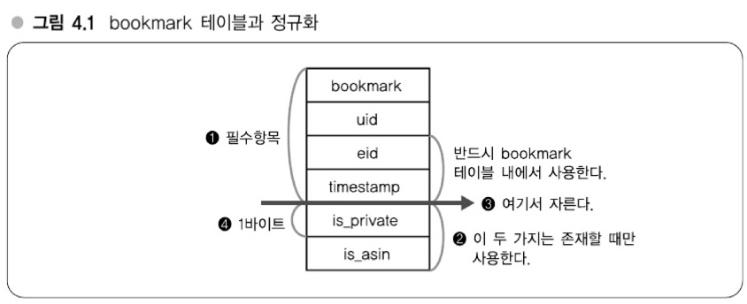
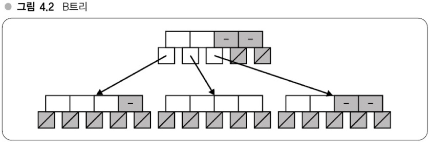
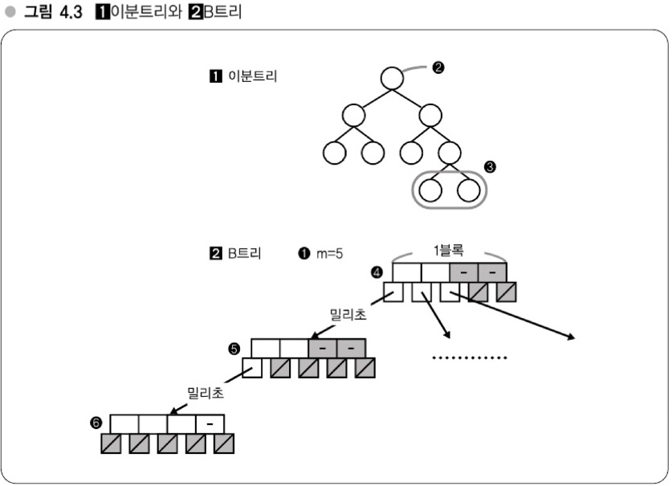
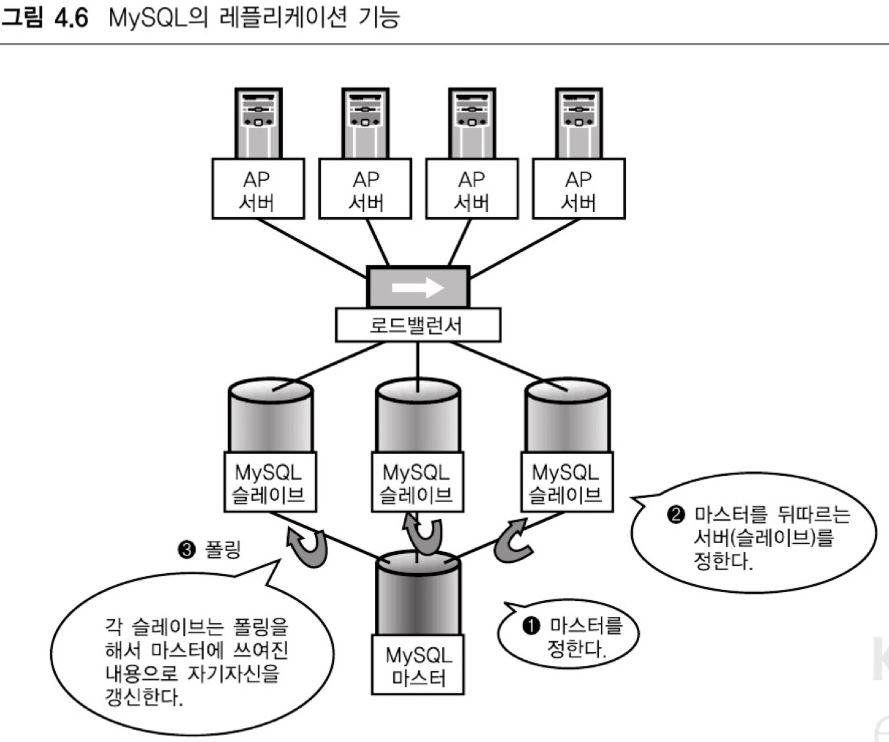
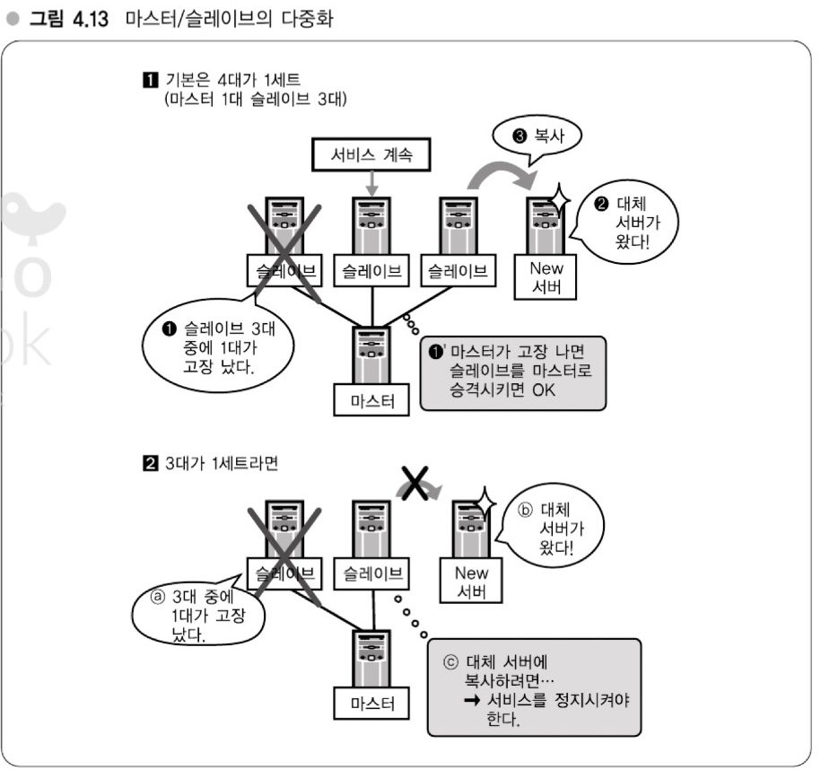

# 04장 - 분산을 고려한 MySQL 운용
## 이번 장에서 다루는 내용
- DB(MySQL) 스케일아웃 전략
- 인덱스의 중요성 (-> 강의 11)
- MySQL 분산 (-> 강의 12)
- 스케일아웃과 파티셔닝 (-> 강의 13)

- - -
## 강의 11: 인덱스를 올바르게 운용하기 (인덱스의 중요성 기억)
### 분산을 고려한 MySQL 운용, 세 가지 포인트
1. OS 캐시 활용 (이전 장에서 설명)
2. 인덱스(index, 색인)
3. 확장을 한다는 전제로 한 시스템 설계 (강의 12 참고)

### OS 캐시 활용
- 전체 데이터 크기에 주의해서 데이터량이 물리 메모리보다 가능한 한 적어지도록 유지
    - 메모리가 부족할 경우 증설 (Q. 전체 데이터 크기가 물리 메모리보다 커질 경우에 증설?)
- 처음 만든 스키마에서 변화가 생길 경우 (데이터 양에 따라 다르지만) 기가바이트 단위로 데이터가 증가하게 됨
    - ex. 하테나 북마크) `3억 로우`, `하나의 레코드`에 `8 바이트 컬럼 하나`를 추가할 경우 `8 * 3억`이므로 3GB 증가
    - 규모가 커질수록 위와 같이 데이터의 증가 단위가 다르기 때문에 변경에 대해 주의가 필요함
- 대량의 데이터를 저장하려는 테이블은 `레코드가 가능한 한 작아지도록` **컴팩트하게** 설계하자.

> **Memo (OS 캐시 활용)**
>
> - 전체 데이터 크기에 주의
    > 	- `데이터 양 < 물리 데이터` 유지
           > 	- 메모리가 부족할 경우에는 증설 등
> - 스키마 설계가 데이터 크기에 미치는 영향 고려하기

#### [추가] 정규화
 

- `1`: 필수, `2`: 필요할 때만 사용
	- 따라서 `2` 부분을 잘라 정규화 적용
- 정규화로 인해 컬럼을 제거할 경우 `1바이트 * 레코드 수`의 용량을 줄 수 있음
- **단**, 쿼리가 복잡해져(join) 속도가 떨어질 수 있음 - `속도`와 `데이터 크기`간 트레이드 오프 고민

### 인덱스의 중요성 - B트리
- MySQL의 인덱스는 기본적으로 `B+트리` 사용
    - `B+트리(B Plus Tree)` : `B Tree`에서 파생된 데이터 주고
    - `B 트리(B Tree)` : 트리를 구성하는 각 노드가 여러 개의 자식을 가질 수 있는 `다분 트리`이고, 또한 데이터 삽입이나 삭제를 반복한 경우에도 트리의 형태에 치우짐이 생기지 않는 `평형 트리`이다.
    - B 트리는 하드디스크 상에 구축하기에 알맞은 데이터 구조이므로 DB에서 자주 사용 됨
- B 트리에 데이터를 삽입할 때는 일정한 규칙에 따라 삽입할 필요가 있다. 이를 통해 탐색을 쉽게 할 수 있음 \
  
- 루트에서 시작해 각 노드에 찾고 있는 값이 저장되어 있는지를 확인하고, 없으면 자식을 찾는 방식
    - 찾는 값의 대소관계로 어떤 자식을 찾아가면 될지가 한 번에 결정될 수 있는 규칙 사용
    - 이에 따라 최대 트리 높이만큼의 횟수만 찾으면 되므로 탐색이 빨라짐
    - 트리의 높이는 데이터 건수 n에 대해 반드시 log n이 되므로 O(log n)의 시간복잡도를 갖는다.

#### 이분트리와 B트리 비교해보기
- `이분트리`는 노드의 자식이 반드시 **2개 이하**, `B 트리`는 노드의 **자식이 여러 개** 있으며 2개 보다 훨씬 많음 \
  
    - 위 그림에서 `1`이 이분트리, `2`가 B 트리이다.
- B 트리의 경우 각 노드를 1블록에 모아 저장되도록 구성해 디스크 Seek 발생 횟수를 최소화 가능
    - 또한 OS가 한 번에 읽어서 메모리에 캐싱하게 되므로 같은 노드 내의 데이터는 디스크 Seek 없이 탐색할 수 있다.
    - 이분트리는 특정 노드를 모아서 1블록에 저장하는 등의 작업이 어려움 (따라서 디스크 구조에 최적화할 수 없음)
- B 트리와 B+트리 차이점은 `B+트리`는 **각 노드 내에 자식 노드로의 포인터만** 가지고 있고, 포인터 이외의 데이터로서의 **실제 값은 제일 마지막인 잎 노드(leaf node)에만 있다**는 점이다.

> **Memo (인덱스의 중요성)**
>
> 인덱스=색인
> B+트리
> 	외부기억장치 탐색 시에 Seek 횟수를 최소화하는 트리 구조
> 	색인의 계산량: O(n) -> O(log n)

### 인덱스의 효과
- 4천만 건 태그 테이블에서의 탐색
    - 인덱스 없다면? -> O(n) -> 최대 4천만 번 탐색
    - 인덱스 있다면? -> B트리로 이분탐색 -> O(log n) -> log 4000만 = 최대 25.25번
- 계산량 측면에서 개선될 뿐 아니라 디스크 Seek 횟수도 개선 같은 O(log n)이라도 B트리와 다른 트리 간에는 서로 다름

#### 인덱스 효과의 예
- 데이터 건수가 1000건이라면 인덱스를 순회하는 것보다 전체 트리를 순회하는 것이 더 빠르다.
    - MySQL은 옵티마이저가 판단해서 인덱스를 사용하지 안흔 편이 더 빠르다고 판단하면 인덱스를 사용하지 않음
    - ex) 전체 데이터 중 80% 이상이 겹치는 경우?

#### [보충] 인덱스의 작용 - MySQL의 특성
- MySQL에서 인덱스를 설정해도 쿼리에 따라 인덱스가 사용되거나 사용되지 않음
    - 기본적으로 인덱스가 사용되는 쿼리
      -> `where`, `order by`, `group by`의 조건에 지정된 컬럼
    - 인덱스로서 작용하는 것은
      -> `명시적으로 추가한 인덱스`, `PK`, `UNIQUE 제약 조건`
- MySQL 인덱스 함정
  -> `복수 컬럼에 동시에 인덱스`를 태우고자 할 경우 `복합 인덱스`를 사용해야 함 (Q. 인덱스 순서도 중요)
  이 중 한 컬럼만 인덱스를 사용해도 된다면 복합 인덱스를 사용하지 않아도 됨

### 인덱스가 작동하는지 확인하는 법 - `explain` 명령
- 쿼리 앞에 `explain` 키워드를 붙이면 사용하고자 하는 쿼리가 어떻게 동작하는지 알 수 있음

#### explain 명령에서 속도에 유의하라
- explain 명령의 `Extra` 컬럼도 중요
    - `Using filesort`  : 레코드 정렬에 **외부 정렬**(**외부 파일을 사용한** 정렬) 사용
    - `Using temporary` : 레코드 정렬에 **임시 테이블 사용**
    - 위 두 가지 정렬 타입 모두 그다지 좋은 쿼리가 아님. 튜닝이 필요할 수 있는 쿼리 더 자세한 이야기는 따로 찾아보자.
- `explain` 결과가 실제 쿼리의 결과라고 생각하지 말자. 즉, 두 개의 explain 쿼리에서 속도가 빠르다고 해당 쿼리가 무조건 더 빠르진 않음 (Q. `explain analyze`는 실제 쿼리가 동작하는 것으로 알고 있는데..? -> MySQL `8.0.18` 부터)

### Column - 인덱스의 간과 (찾기 쉬운 구조로 커버)
- ORM으로 인해 쿼리가 어떻게 동작하는지 모르고 커밋하는 경우가 많다고 함 - 이를 위한 `감시방안(모니터링)`을 늘리자고 함
    - `감시방안(모니터링)` : `slow log`(`slow query`)가 발생했을 때 **개발자에게 리포트** 하는 등

- - -
## 강의 12: MySQL의 분산 - 확장을 전제로 한 시스템 설계
### MySQL의 레플리케이션 기능
- MySQL 기본적으로 레플리케이션 기능이 있음.
    - 여러 DB 서버에서 master를 정하고, 나머지 서버는 slave
    - slave 서버는 master에 쓴 내용을 polling해서 동일한 내용으로 자신을 갱신하게 된다.
- master/slave로 서버를 여러 대 준비하면 AP 서버에서는 로드밸런서를 경유해 슬레이브로 질의 가능
    - **쿼리를 여러 서버로 분산**할 수 있음 (update성 쿼리는 master, read성 쿼리는 slave로 분산)
      

### 마스터/슬레이브의 특성 - 참조계열은 확장하고 갱신계열은 확장하지 않음
- 위 그림의 그림의 단점에선 마스터를 분산할 수 없다는 단점이 있음
    - 그렇다면 `마스터를 어떻게 다중화 할 지`에 대한 문제도 발생

#### 갱신/쓰기 계열을 확장하고자 할 때 - `테이블 분할`, `key-value 스토어`
- 테이블을 분할하고, 해당 테이블마다 다른 서버로 분산하는 방식
- RDB말고 key-value 스토어 방식 사용
    - key-value 스토어는 오버헤드도 적고 압도적으로 빠르며 확장하기 쉬움 (OLAP 환경에서 적합)
    - RDB는 복잡한 통계처리나 범용적인 정렬 처리가 잘 되어 있음 (OLTP 환경에서 적합)
- 애플리케이션 측면에서 쓰기 작업 횟수를 줄이는 연구를 해야 함

> **Memo (마스터/슬레이브의 특징)**
>
> **참조계열(슬레이브) 쿼리는 확장**
> - 서버를 늘리면 됨
> - 단, 대수를 늘리기보다 메모리에 맞추는 것이 중요
>
> **마스터는 확장하지 않음**
> - 갱신계열 쿼리가 늘어나면 어려움
> - 단, 웹 애플리케이션은 대부분의 경우 참조 쿼리 (파레토, 롱테일, 8:2 법칙)
> - 마스터 부하는 테이블 분할이나 다른 구현 등으로 연구

- - -
## 강의13: MySQL의 스케일아웃과 파티셔닝
### MySQL의 스케일아웃 전략
> **Memo (MySQL의 스케일아웃 전략)**
>
> 데이터가 메모리에 올라가는 크기?
> - YES
    > 	메모리에 올린다.
> - NO
    > 	메모리 증설
    > 	**메모리 증설이 불가능하다면 파티셔닝 <<---- 이번 챕터에서 다루는 내용**

### 파티셔닝(테이블 분할)에 관한 보충
- `파티셔닝` : `테이블 A`와 `테이블 B`를 **서로 다른 서버에 놓아 분산**하는 방법 (Q. 꼭 다른 서버에 분산해야 되나?, 108p)
    - 지역성을 활용해 분산할 수 있으므로 캐시를 더 잘 사용할 수 있음 (단점. JOIN 어려워 짐)

### 파티셔닝을 전제로 한 설계
- **분할이 필요해 보이는 테이블들끼리 join하는 쿼리를 사용하지 말자.**
- MySQL에는 서로 다른 서버에 있는 테이블을 JOIN하는 기능이 기본적으로 없음 (5.1에서 `FEDERATED` 테이블을 통해 가능)
- 즉, JOIN 쿼리는 대상이 되는 테이블을 앞으로도 서버 분할하지 않을 것이라고 보장할 수 있을 때만 사용 가능

### JOIN 배제 - `where ... in ..` 이용
- INNER JOIN으로 사용되는 쿼리를 in 쿼리로 변경하자고 나오는데..
    - -> 인덱스가 잘 설정되어 있다는 가정하에 성능상 큰 문제는 없을 것 같다. (파티셔닝을 위해 사용하지 말자는 건가?)

### 파티셔닝의 상반관계 - 파티셔닝의 단점
#### 운영이 복잡해짐
- 용도가 다른 서버가 생기게 됨. 같은 서비스를 하는 DB지만, 각각의 서버가 어떤 일을 하는지 머릿속으로 파악해야 됨
- 이렇게 되면 어디에 어떤 DB가 있는지 파악하는게 어려움

#### 고장률이 높아짐
- 대수가 늘어가는 만큼 고장률도 높아짐
- 머신을 늘릴 때는 1대만 늘려서는 끝나지 않음 (바로 밑에서 확인)

#### 다중화에 필요한 서버 대수는 몇 대?

- `마스터 1대 + 슬레이브 3대 = 4대`로 운영하는 이유는 위 그림처럼 `3대로 운영했을 때 서비스를 정지하는 상황` 발생
    - Q. 다중화 서버를 운영할 때 `정족수 투표`를 위해 홀수대 수로 운영하는 것이 좋다고 알고 있는데 이 부분은 어떻게 해야 되는지 궁금합니다.
    - -> MySQL의 replication 서버를 중지하지 않고 새로운 서버를 비동기로 복제할 수 있다면 가능할 지도?

#### 애플리케이션의 용도와 서버 대수
- 무정지가 필수 조건인지 생각해보자.
    - 서비스의 일부 부분(자주 사용되지 않는 부분이라면 더)이 중지되어도 괜찮다면 점검이 있어도 상관 없을 것 같음

#### 서버 대수와 고장률
- 서버를 분할할 때 하나의 세트 씩 늘리므로 세트 구성수가 많다면 대수가 한꺼번에 늘게 된다.
    - 고장률도 당연히 증가, 따라서 스케일 업과 비용? 유지보수? 등 여러 방면으로 생각하고 정하자.

> **Memo (파티셔닝의 상반관계)**
>
> **장점**
> - 부하가 내려감
> - 지역성이 증가해 캐시 효과가 높아짐
>
> **단점**
> - 운영이 복잡해지고, 고장률이 높아짐
> - 비용 증가 (스케일 업이 더 저렴할 수 있음)
>
> 파티셔닝은 언제나 마지막 카드

- - -
## 2 ~ 4장 정리
- 캐시가 중요하고, 메모리가 빠르다는 이야기를 함
- 운영에 관한 이야기가 많음

