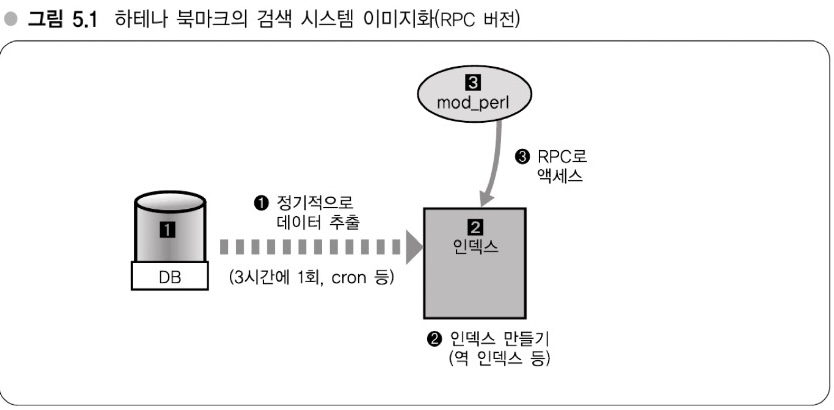

# 05장 - 대규모 데이터 처리 실전 입문
- - -
### 이번 장에서 다루는 내용
- 이 장의 소제목이기도 한 `(대규모 데이터를 이용하는) 애플리케이션 개발의 급소`에 대해 알아봄
- 전문 검색, 데이터마이닝 등에 사용되는 **광범위한 데이터 엑세스** (통계 처리, 검색)
- MySQL 등에서 처리할 수 없는 규모의 데이터를 대상으로 개선하고자 할 때 어떻게 해야 되는지

> Memo (대규모 데이터를 처리하는 애플리케이션)
>
> - 용도특화형 인덱싱 (-> 강의 14)
> - 이론과 실전 양측과 맞붙어 싸우기 (-> 강의 15)

- - -
## 강의14: 용도 특화형 인덱싱
- 대규모 데이터를 능수능란하게 다루기

### 인덱스와 시스템 구성 - RDB의 한계가 보일 때
- 전문 검색, 데이터마이닝 등 이러한 경우 RDB로는 한계가 있음
- 배치 처리 같은 곳에서 **RDB에서 데이터를 추출해 별도의 인덱스 서버**와 같은 것을 만들고, 해당 인덱스 서버에 웹 애플리케이션에서 RPC(Remote Procedure Call) 등으로 엑세스하는 방식 사용

#### RPC, 웹 API

1. DB에서 정기적으로 3시간에 1번씩 cron 등으로 데이터 추출
2. 추출한 데이터 인덱스 서버로 넘김
3. 인덱스로는 검색용 역 인덱스(`강의 26참고`)를 만듦
4. AP 서버에서는 인덱슬를 갖고 있는 인덱스 서버로 RPC로 엑세스

 

- `그림 5.1`에서 조금 바꾸면 위 그림처럼 됨
    - `2` 인덱스 서버에서 `4`(JSON)을 만드는 것이 추가 됨
    - `3`에서 웹 API로 JSON에 엑세스 (필요에 따라 `4`부분을 C++ 같은 성능이 좋은 언어로 변경 가능)
- `3` AP 서버에 인덱스를 직접 저장하지 않은 이유는 `3`에 충분한 메모리가 탑재되어 있지 않은 경우 대비를 위함
    - AP 서버를 구성할 때 CPU 연산이 많은 서버여서 메모리가 충분하지 않을 수 있음
    - AP 아키텍처 면에서 큰 검색 인덱스를 여러 프로세스에서 같이 사용하도록 구성하는 것 또한 적합하지 않음
    - AP 서버가 20대 가량 있을 경우 20대 전부 인덱스를 갖는 것도 좋지 않음
    - 따라서 인덱스 전용 서버에서 처리하도록 함

> **Memo (RDB로 한계일 때 어떻게?)** -> 25.03.25기준에서는 NoSQL?
>
> 배치 처리로 데이터 추출
> 별도 인덱스 서버를 만들어 웹 API 등으로 쿼리

### 용도특화형 인덱싱 - 튜닝한 데이터 구조 사용하기
- 위와 같은 인덱스 서버를 하테나에서는 `용도특화형 인덱싱`라고 부름
- RDB는 갖고 있는 범용적인 용도로 만들어져 있음. 따라서 특정한 목적만으로 사용할 수 있는 인덱스 서버를 만듦
- 이렇게 만든 서버를 사용하면 압도적으로 빠름
    - ex. `검색`에서 `역 인덱스`) 자연어처리와 같은 처리를 미리하고, 인덱스를 만들어두면 RDB를 순회하지 않아도 됨

> **Memo (용도특화형 인덱싱)**
>
> - 데이터를 정기적으로 뽑아낸다.
> - 뽑아낸 데이터에서 데이터 구조를 구축
    > 	- 검색용 역 인덱스
           > 	- 키워드 링크용 Trie
> 	- 등
> - 구조화 데이터를 저장한 서버를 C++로 개발, RPC 액세스

#### [예] 하테나 키워드에 의한 링크 - 검색 이외에 용도특화형 인덱싱에 관련된 사례
- 7장에서 자세히 나오는 하테나 `키워드 링크`를 `용도특화형 인덱싱`으로 만듦
- 특정 문서가 20만 이상의 키워드 중 무엇을 포함해야 하는지 찾아내야할 때
    - 배치 처리로 20만 건의 키워드 추출하고, 10만 건의 정규표현이 들어간 거대한 파일로 만들어 메모리에 올려 이를 매칭
    - 정규표현만으로 힘들어 Trie 기반의 정규 표현으로 개선 (Trie + Common Prefix Search)
    - 참고) Common Prefix Search을 할 때 `Aho-Corasick`, `Double Array Trie`등 다양한 알고리즘/데이터 구조가 있음
- 키워드 링크의 방식 : 위에서 본 `알고리즘의 데이터 구조를 DB에서 사전에 추출해 만들어두고 매칭`

#### [예] 하테나 북마크의 텍스트 분류기
- 북마크에서 `과학-학문`, `컴퓨터-IT` 등 **기사의 카테고리를 자동분류할 때** `용도특화형 인덱싱`이 사용 됨
- `Complement Naive Bayes`라는 알고리즘 사용
- DB에 어떤 단어가 들어있고, 이건 몇 건과 같은 정보들에 대해 출현확률(출현빈도) 만을 저장하는 서버

#### 전문 검색엔진
- 다음의 포인트를 어떻게 쿼리할 것인가
    1. 대량의 데이터에서 검색하고 할 때
    2. 빠르게 검색하고자 할 때
    3. `좋은 느낌`과 같은 문서를 상위로 표시할 때
- `3`번이 가장 어렵고, 이를 위해 `스코어링` 처리를 수행
    - `스코어링`은 검색대상 문서의 다양한 정보를 복합적으로 이용하므로 RDB에서는 무리다.
    - 반대로 전문 검색엔진을 직접 구현한다면 스코어링 알고리즘도 자유롭게 선택할 수 있어 RDB보다 훨씬 유연
    - 전문 검색엔진을 만드는 것과 관련해서는 9, 10장 참고

> Memo (RDB -> 정보검색)
>
> RDB의 데이터를 배치로 얻기
> 역 인덱스를 만들어서 검색 알고리즘 사용

- - -
## 강의15: 이론과 실전 양쪽과의 싸움
### 요구되는 기술적 요건 규명하기
- RDB에서 JOIN을 사용하지 않는 것과 같은 방법은 배드 노하우(좋지 않은 노하우) 일 것이다.
    - `배드 노하우` : 소프트웨어 등을 이용하기 위해 스트레스를 받아가면서도 익혀야 하는 노하우(복잡한 설정 같은)
    - `분할을 위해 JOIN을 사용하지 않아요` -> `RDB를 왜 써요`가 될 수 있다.

#### 대규모 웹 애플리케이션에 있어서 이론과 실전
- 이론과 실전 사이에서 균형을 잘 맞춰 실행해야 된다.
- 이론을 너무 추구하다 막상 구현 때 여러 배드 노하우가 표출되고, 반대로 배드 노하우만 알고 있다면 대규모 데이터를 어떻게 처리할 지 모르게 된다.
- 하테나는 이론보다 실전에 강한 회사였다.
    - 개발의 원리보다 프레임워크로 어떻게든 빨리 적은 에러로 웹 애플리케이션을 만들었음
    - 그러다 서비스가 히트해서 문제점이 커지게 됐을 때 기존에 노하우로 통용되지 않았음
    - 이때는 새로운 기술이나 노하우가 아닌 `이론`을 봐야 함

#### 컴퓨터의 문제에 이르는 길을 어떻게 발견할까?
- `하고자 하는 것을 컴퓨터의 문제로 전환해서 해결에 이르는 길을 찾을 수 있는지 여부.`
- 이를 위해 이론적으로 배울 뿐 아니라 응용을 위한 이치를 어느 정도 익혀두는 것도 중요하다.

- - -
### 2 ~ 5장 정리
1. 기가바이트 단위의 데이터 처리를 예를 보면서 설명.
    - 테라, 페타바이트는 또 다른 세계
2. 메모리가 중요, 분산을 전제로 한 운영과 설계, 적절한 알고리즘과 데이터 구조 선택
- 이후 6 ~ 10장은 애플리케이션 개발자를 대상으로 대규모 데이터를 처리하는 핵심 요소를 파악한다.
    - 6장 : 압축 프로그래밍
    - 7, 8장 : 알고리즘, 데이터의 실용화에 대해
    - 9, 10장 : 검색엔진 만들기

