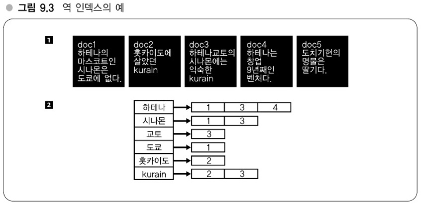

# 09장 - 전문 검색기술 도전
> **Memo - 전문 검색기술 도전**
> - 전문 검색 기술의 응용범위 (-> 강의 24)
> - 검색 시스템의 아키텍처 (-> 강의 25)
> - 검색엔진의 내부구조 (-> 강의 26)

- - -
## 강의24: 전문 검색기술의 응용범위
### 하테나의 데이터로 검색엔진 만들기
- 시작하기전 검색 엔진의 중요한 요소 중 하나인 `역 인덱스(inverted index)`는 다음과 같이 구성되어 있음
    - `Dictionary`라는 부분과 `Postings`라는 부분으로 구성

### 하테나 다이어리의 전문 검색 - 검색 서비스 이외에 검색 시스템 이용
- 하테나 다이어리의 전문을 검색 대상으로 해서 하테나 키워드로 이를 검색 가능하게 하는 시스템
    - 원하는 검색어로 검색할 수 있는 엔진이 아니라 하테나 키워드에 포함되어 있는 단어만 검색할 수 있는 시스템
    - 서버 메모리 스펙을 8GB 정도의 리소스로 모든 다이어리 검색 가능

#### 초기에는 RDB로 처리
- 위와 같은 기능을 RDB로 처리했다.
    - 누군가 블로그에 새로운 글을 작성하면 해당 글에 포함되어 있는 키워드를 전부 추출한다.
    - 이로인해 이 블로그는 XX단어를 포함하고 있는지를 알 수 있었다.
    - 이를통해 이 단어와 블로그의 연관성을 데이터베이스의 레코드로서 저장해두었다.
- 하지만 이 RDB 방식은 레코드 수가 많아지면 무거워지는 탓에 **확장성 측면에서 좋지 않음**.

#### 검색기술의 응용
> 검색 시스템을 검색 서비스 이외에 응용
> - 하테나 다이어리의 포함하는 블로그
> - DB로 처리할 수 없음 -> 검색엔진 구현
> - 서비스에 특화된 사양도 포함시켜 고속화
> - C++로 구현, Thrift로 Perl과 통신

### 하테나 북마크의 전문 검색 - 세세한 요구를 만족시키는 시스템
- 하테나 북마크의 전문 검색은 자신이 북마크한 사이트만 대상으로 한 전문 검색엔진이다.
- 앞선 다이어리 전문 검색와 다른 점은 `시스템의 규모`나 `이용목적`이다.
    - 하테나 북마크에 저장된 모든 데이터로부터 검색하는 것이 아니라 각 개인이 북마크한 **개인 데이터로부터 검색하는 시스템**
        - 비교적 작은 데이터를 검색하는 엔진
    - 기능면에서 다른 점은 스니핏(snippet) 제공

> **대규모 데이터를 작게 나누어 검색**
> - 사용자별로 검색 인덱스를 만든다.
> - 컴팩트한 구현, 간단한 구현
> - 직접 구현함으로써 세세한 요구에 대응할 수 있음

- - -
## 강의25: 검색 시스템의 아키텍처
### 검색 시스템이 완성되기까지 6단계
1. `크롤링` - 검색할 대상 문서 가져오기
2. `저장` - 가져온 문서를 어떻게 저장할 지 (하나의 데이터베이스에 넣는다면 해당 데이터베이스가 고장날 때는?)
3. `인덱싱` - 가져온 문서로부터 인덱스 구성 (고속으로 검색하기 위해 색인 구조 사용)
4. `검색` - 검색 결과 반환
5. `스코어링` - 위에서 PageRank같은 것을 지원하기 위해 스코어링(= 랭킹) 기법 사용
6. `결과표시` - 스코어링까지 완료된 결과 표시

#### 3번과 4번을 중점으로 강의함
- `크롤링`, `저장`은 검색에만 한정되지 않은 일반적인 문제라 생략
- `스코어링`이나 `결과표시`는 인덱싱과 검색이 가능하면 어느 정도 방법이 자명해 생략
    - Introduction to Information Retrieval(Cambridge University Press, 2008) 논문 참고

### 다양한 검색엔진 - 오픈소스 포함
- grep
- Namazu
- Hyper Estraier
- Apache Lucene - Wikipedia에서 사용, Java로 구현되어 있음
- Shunsaku
- Senna
- Sedue
- Lux

### 전문 검색의 종류
- `grep 형`, `Suffix 형`, `역 인덱스 형` 3가지만 소개
- `grep 형`
    - grep, Shunsaku
    - 검색 대상 문서를 처음부터 읽어가는 방식, 가장 단순한 아키텍처
    - 검색 대상인 텍스트(text)의 길이를 m, 검색하려는 검색어(word)의 길이는 n이라고 할 때 O(mn)만큼 걸린다.
    - 단순하게 할 경우 검색 처리로는 시간이 많이 걸리는 편 그래서 다른 알고리즘을 사용할 수 있음
        - 단순 검색 -> O(mn), text:m, word:n
        - KMP법 -> O(m+n), (AC법과 비슷)
        - BM법 -> 최악일 때 O(mn), 최선일 때 O(n/m)
    - 장점으로는 즉시성이 좋음 -> `문서가 갱신되더라도 바로 검색`할 수 있고, `검색누락이 없고`, `병렬화하기 간단`하다는 장점이 있음
  > **Memo - grep 형**
  >	- 검색 대상을 처음부터 읽음
  >	- 즉시성이 좋고, 검색 누락이 없으며, 병렬화(파일을 분할해 검색)나 쿼리 확장이 용이, 정규 표현 사용하기 간단
  >	- 대규모 환경을 지원하게 만들기 어려움

- `Suffix 형` - 하테나에서 사용
    - PFI의 Sedue
    - 데이터 구조로는 Trie나 Suffix Array, Suffix Tree 등이 있음
    - 문서를 `검색 가능한 형태`로 가지고 있으며 전부 `메모리에 올릴 수 있는` 형태 (역 인덱스는 **문서 전체**를 가지지 않음)
  > **Memo - Suffix 형 (그 밖의 형태)**
  > - 검색 가능한 형태로 검색 대상 전문 보유
  > - Trie, Suffix, Tree, Suffix Array
  > - 이론적으로는 가능
  > - 정보량이 크고 구현이 어려움

- `역 인덱스 형` - 주류 (Google의 기본은 역 인덱스 형을 사용)
    - 단어(term)와 문서를 연관짓는 일
    - 검색하기 전 인덱스를 전처리로 만드렁야 함 (문서가 변경되면 즉시성이 grep보다 안 좋음)
    - 인덱스를 압축해 컴팩트하게 가져갈 수 있으므로 대규모화하기 좋음
  > **Memo - 역 인덱스 형**
  > - term과 문서를 연관지음
  > - 밸런스 좋은 아키텍처
  > - 실제 시스템의 상당수가 역 인덱스 사용
  > - 즉시성은 좋지 않음, 검색누락이 생길 수 있음

- - -
## 강의26: 검색엔진의 내부구조
### 역 인덱스의 구조 - Dicionary + Postings

- term을 포함하고 있는 문서는 몇 번인지 나타내는 것이 우측 배열
    - term : 문서 내의 단어이고, 문서를 검색할 수 있는 단위
- 역 인덱스는 term을 폼하는 문서를 즉시 발견할 수 있는 구조로 되어 있음
> **역 인덱스**
> - term과 문서 연관짓기
> - term - 문서 내의 단어
> - 역 인덱스 = Dictionary + Postings
> - term을 포함하는 단어를 즉시 발견

### Dictionary 만드는 법 - 역 인덱스 작성법 #1
- term을 어떻게 선택하는지
    - 미리 정해놓은 사전 사용, AC법과 같은 것으로 단어 분리, 형태소 분석 사용, n-gram 기법 사용
> **Dictionary의 구성**
> - 단어를 term으로 다룸
> - 사전 + AC법으로 단어 분리
> - 형태소 분석 수행
> - n-gram을 term으로 다루기

- 영어의 경우 공백(space)를 기준으로 문서의 단어를 분해할 수 있음
    - 일본어는 공백이 없음 따라서 `1. 사전 + AC법` 또는 `2. 형태소 분석`을 사용하려고 함

 
1. 사전 + AC법
- 사전이 곧 검색 시스템의 단어 공간 - 사전에 있는 단어만 검색 가능
2. 형태소 분석을 이용하는 방법(형태소를 단어로 간주해서 term으로 사용)
- 이때 당시의 일본에서 유행하는 형태소 분석기는 MeCab이라는 것이 유명
- 한국어의 형태소 분석기로는 `아리랑`, [은전 한 닢, MeCab 기반](https://eunjeon.blogspot.com/2013/02/blog-post.html), [노리, 루씬 기반](https://esbook.kimjmin.net/06-text-analysis/6.7-stemming/6.7.2-nori) 엔진 - ES 엔진의 형태소 분석기

- 형태소 분석기는 문장을 형태소로 나눠 품사를 추청한다. (품서 추정은 형태소 분석용 사전을 가지고 있어 추정함)

> **형태소 분석**
> - 품사를 추정
> - 사전을 가지고 있음
> - 사전에 없는 단어도 예층 가능(한 것도 있음)
> - 단어 배열을 고려
> - 단어 배열을 기계학습(하는 경우도 있음)
> - 사전을 커스터마이징할 수 있음

#### n-gram을 term으로 다루기
- n-gram은 k-gram이라고도 하며, 텍스트를 n자씩 잘라낸 것을 뜻함
    - ex) `abracadabra`라는 단어의 3-gram은 `abr`, `bra`, `rac`, .. 등이 됨

#### n-gram 분할 문제와 필터링
- n-gram은 잘못된 검색을 수행하는 문제가 있어 검색결과가 나온 후 **필터링을 수행** (226p)
> **필터링**
> - 검색결과를 조사해서 확인
> - 대상이 크면 계산량이 많음 (대상이 작을수록 좋음)

#### 검색 시스템 평가와 재현률/적합률
- 결과가 타당한지에 대해 정량적인 평가를 내리기 위한 기준으로 `재현률`과 `적합률`이 있음
    - `재현률` : 어느 정도의 양, 결과를 반환하는 지
    - `적합률` : 명백히 타당한 결과를 얼마나 반환되고 있는 지
    - 의도하지 않은 결과가 나오는 경우는 적으므로 적합률이 우선시 됨
> **재현률과 적합률**
> - 검색의 타당성 평가 기준
> - 올바른 결과를 반환했는가?
>   - 접합률 - 올바른 결과의 수 / 반환한 결과 총수
> - 이것저것 망라해서 반환했는가?
>   - 재현률 = 올바른 결과의 수 / 적합한 결과 총수

- - -
### 잠깐 정리
- 검색엔진의 세 가지 종류 - grep, suffix, 역 인덱스 형이 있음
    - 각각의 장단점이 있고, 현재 주류는 역 인덱스 형
    - 역 인덱스 형은 `Dicionary + Postings`라는 구조로 되어 있음
    - 역 인덱스 형의 Dictionary를 만들 때 구성하는 다양한 기법이 있음 - 여기서는 형태소 분석 및 n-gram을 설명

- - -
### Postings 작성법 - 역 인덱스 작성법 #2
> **Postings**
> - 출현 위치도 저장하는 경우
>   - Full Inverted Index
>   - 스니핏, 스코어링, 필터링이 용이
> - 문서ID만 저장하는 경우
>   - Inverted File Index
>   - 크기가 작고 구현이 용이

- term에 해당하는 단어를 포함하는 문서 번호 또는 ID를 지니고 있는 배열이라 생각해도 좋음
- Postings를 구성하는 몇 가지 기법
    - `Full Inverted Index` : term이 해당 문서 내의 어느 위치에 출혀나는지 출현 위치를 저장하는 경우
        - 출현위치를 알고 있어 스니핏을 뽑아낼 때 바로 알 수 있고, 스코어링에도 도움이 됨
        - 구글도 이 방식을 사용하고 있을 거라는 예상
        - 두 단어가 위치면에서 연결되어 있다면 n-gram을 이용할 때 필터링을 할 경우 사용 가능
    - `Inverted File Index(역 파일 인덱스)` : term에 해당하는 문서 ID만 저장
        - 출현 위치를 저장하지 않아 크기가 작고, 구현 간단
        - term에 대응하는 문서ID가 나열된 배열에 불과해 데이터 구조도 간단 (문서 ID는 정렬)
        - term을 키로, 압축된 문서 ID를 밸류로 사용 가능 -> key-value 스토어로 저장하기 적합

> **Postings와 데이터 구조**
> - 문서 ID 순서
>   - 정렬 -> VB Code
>   - 어느 정도의 압축률과 빠른 전개 성능
> - 구조: term => 압축된 Postings List
>   - key-value 스토어에 적합

### 스코어링에 대한 보충
- 어떤 순서로 표시할 건지 상당히 중요한 문제 이를 다룰 때 스코어링이 필요
    - 구글의 PageRank도 이런 문제를 해결하기 위해 나옴
- 이와 관련된 참고 자료가 나오는데, 너무 예전 자료들이라서 (2008 ~ 2009년도 자료) 제목만 첨부
    - Introduction to Information Retrieval - 검색엔진에 필요한 내용을 다룸
    - Algorithms on String - KMP, BM 법 등 텍스트를 어떻게 빠르게 검색할 수 있는지 다룸
    - Managing Gigabytes - 1999년도 책, 검색엔진의 내부구조를 다룸

