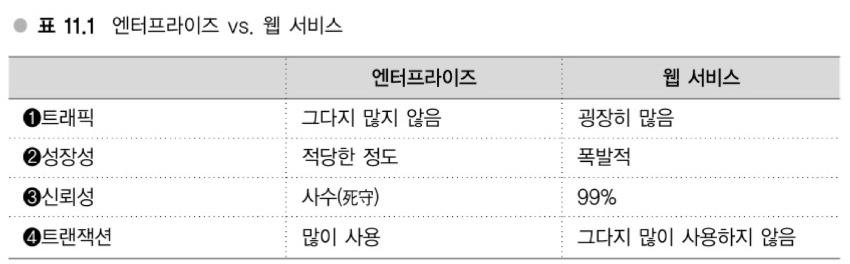
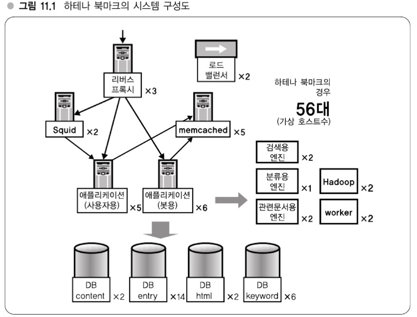

# 11장 - 대규모 데이터 처리를 지탱하는 서버, 인프라 입문
## 하테나의 인프라스트럭처 (11 ~ 15장에 대해서)
> **Memo - 하테나의 인프라스트럭처**
> - 웹 서비스의 인프라 특징과 하테나의 특징 -> 11장
> - 각종 기술
> 	- 확장성 -> 12장
> 	- 다중화 -> 13장
> 	- 효율향상 -> 14장
> 	- 네트워크 -> 15장

- - -
## 강의29: 엔터프라이즈 vs 웹 서비스
### 응용범위로 보는 차이
- 이 책이 쓰여진 상황을 기준으로 웹 서비스는 10년정도 붐이 일어난 정도
	- 엔터프라이즈라는 영역에 비해 적은 영역
	- `엔터프라이즈` : 돈이나 생명 같은 것과 관련된 영역이 많은 환경
- 즉 `엔터프라이즈`와 `웹 서비스`는 시스템화해야 할 대상 영역의 차이도 다름
	- 세부적인 기술이 다름

#### 웹 서비스의 특징
 \
- `엔터프라이즈 시스템: 병원, ATM 기기`, `웹 서비스: 트위터`로 생각해보면 위 비교가 이해 됨

### 웹 서비스의 인프라 - 중요시되는 세 가지 포인트
1. 저비용 고효율 중시
	- 이를 위한 trade-off로 100% 신뢰성을 목표로하지 않음
	- 비용을 들여 꽤 높은 신뢰성(그래도 100%는 없음)을 유지할 수 있지만 저비용으로 효율을 높이는 방향
2. 확장성이나 응답성 등에 대한 설계를 중요시
	- 100% 신뢰성보다 확장 가능한 것이 더 중요
	- 99%의 시간대는 양호한 응답으로 이루어지도록 하는 등 기술적으로 중점을 둔 설계가 중요
3. 서비스 사양이 바뀌게 되어도 유연하게 대응할 수 있는 인프라
	- 서비스의 사양을 추가하고자할 때 반년 또는 1년 전부터 기획하고 준비해서 개발한다고 함
	- 웹 서비스 영역에서 이런 식으로 개발하면 시기를 놓칠 수 있음
	- 따라서 개발속도를 중시한 인프라로 구성하는 것이 중요

> **요약**
> - 저비용 고효율: 100% 신뢰성을 목표로 하지 말아라
> - 설계: 확장성, 응답성이 더 중요
> - 개발속도: 서비스에 대해 기동성 있게 리소스를 제공할 수 있어야 함

- - -
## 강의30: 클라우드 vs 자체구축 인프라
### 클라우드 컴퓨팅
- EC2, GCP, Azure 이런 것들에 대한 설명
- 이 책의 시점에선 하테나는 자체구축 인프라로 거의 전부 구축하고 있음

### 클라우드의 장단점
- 클라우드의 최대 장점은 **확장성**이다.
- 단점으론 EC2 등 각각의 클라우드 서비스마다 독자적인 사양에 대응할 필요가 있음
	- ex. 2010.04 EC2 기준) 호스트 사양만 준비되어 있음
	- 메모리를 대량으로 늘리려고 해도 어느 정도 이상은 늘릴 수 없음
	- 내부 동작을 모르고 사용 (LB에 대해 나오는데 어떤 알고리즘을 사용하는 지 모른다고 함)
	- 클라우드 제공사에서 장애 발생 시 대처할 수 없음
- 이 시점에서는 장점도 있지만 아직 자체구축 인프라가 유리하다고 함

> **요약**
> - 장점
> 	- 확장의 유연성
> - 단점
> 	- 획일적인 호스트 사양(메모리 상한성 68GB, 느린 I/O)
> 	- 애매한 로드밸런서
> 	- 때때로 멈춘다(2010년 4월 집필시점)

### 하테나에서의 클라우드 서비스 사용
- 그래도 일부는 AWS를 사용 중: CDN으로 Amazon Cloudfront 사용
- 클라우드를 사용하는 추세는 증가할 것이지만 하테나는 국소적으로 도입해 나간다고 함

### 자체구축 인프라의 장점
1. 하드웨어 구성을 유연하게 할 수 있음
	- 캐시로 사용할 메모리를 얼마든지 탑재할 수 있음 (**소프트웨어 레벨에서 분산처리**도 중요)
	- 새로 나오는 하드웨어 (SSD 등) 투입에 자유로움
2. 서비스로부터의 요청에 유연하게 대응할 수 있음
	- 사용자에게 지리적으로 가까운 곳에 서버를 둘 수 있음 (네트워크 측면에서 가까운 곳)
	- 클라우드 컴퓨팅도 개선할 수 있는 부분이기도 함
3. 병목현상을 제어할 수 있음
	- 클라우드를 사용하면 어떤 거동을 하고 어디에서 병목이나 지연이 발생하는 지 클라우드 환경을 제공하는 측의 기술을 의존할 수 밖에 없음, 자체 구축은 이 병목현상을 제어 가능

### 자체구축 인프라와 수직통합 모델
- `수직통합 모델`: 물리적 계층부터 서비스 설계까지 모든 것을 한 회사에서 구축하는 모델
	- ex) Google, Amazon
- `수평분산 모델`: 각 계층마다 다른 기업이 시스템을 제공, 각각이 모여 전체 시스템이 구축되는 모델
	- ex) Microsoft와 같은 OS와 오피스군과 같은 일부 애플리케이션에 특화된 기업
- 하테나의 경우 디자인, 애플리케이션, 인프라 모두 수직통합 모델 채택

### 하테나의 서비스 규모
2010년 4월 기준
- 등록 사용자 수 150만, 1900만 UU/월
- 수십업 액세스/월 (이미지로의 액세스 제외)
- 피크 시 회선 트래픽량 850Mbps
- 하드웨어 600대 이상 (랙 22개)
	- 가상화해서 1300대 정도의 규모

### 하테나 북마크의 시스템 구성도
- 리버스 프록시 3대
- AP 서버 11대
- DB 서버 24대
- 캐시서버 7대 - Squid 2대, memcached 5대
- 로드밸런서 2대
- 그 외 엔진 9대
- 총 56대

- 각각의 서버는 가상화되어 있으므로 물리적인 대수는 실제로는 좀 더 적다.
- 전체적인 구조는 (리버스) 프록시와 애플리케이션, DB 3층 구조로 되어 있음
- AP 서버와 DB 서버 비율은 1:2 정도

